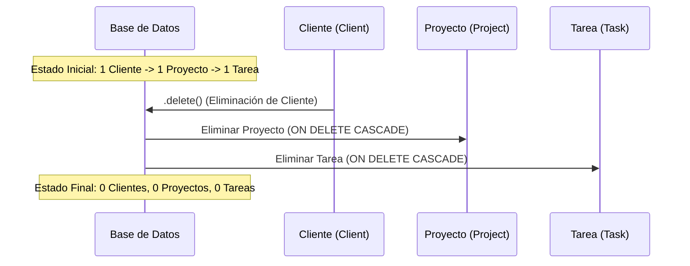

# 🧪 RootDev Backend Testing Suite

Este documento explica en detalle la estructura, configuración y ejecución del conjunto de pruebas unitarias y de integración para el backend de **RootDev**.

---

## 🚀 Cómo Ejecutar las Pruebas

El proyecto cuenta con un script automatizado para la ejecución de las pruebas.

### Opción 1: Usando el script `test.sh`
Desde el directorio del backend (`backend/`), ejecuta:
```bash
./test.sh
```

*Nota: Este script activará automáticamente el entorno virtual `venv` si existe y ejecutará las pruebas en la aplicación `freelance_core`.*

### Opción 2: Usando `manage.py` directamente
Si prefieres ejecutar el comando manualmente:
```bash
# Con el entorno virtual activo:
python manage.py test freelance_core
```

---

## 📁 Ubicación de las Pruebas

Toda la lógica de pruebas se encuentra en:
*   [freelance_core/tests.py](file:///home/armintec/Documentos/ING600/proyecto/backend/freelance_core/tests.py)

---

## 🛠️ Configuración Inicial (`setUp`)

Antes de la ejecución de cada método de prueba, el método `setUp()` inicializa el entorno de base de datos de pruebas con las siguientes entidades básicas:
1.  **Usuario de Prueba (`User`)**: `username='testuser'`, `password='password123'`.
2.  **Cliente de Prueba (`Client`)**: Vinculado al usuario anterior, con nombre `'Cliente de Prueba'`, correo `'cliente@prueba.com'`, y empresa `'Empresa Test'`.

---

## 📋 Detalle de los Casos de Prueba

La clase `RootDevTests` hereda de `django.test.TestCase` e incluye 7 métodos que validan la integridad del modelo de datos y el flujo de autenticación del usuario.

| Método de Prueba | Tipo de Validación | Descripción | Validaciones Clave (Assertions) |
| :--- | :--- | :--- | :--- |
| **`test_client_creation`** | Creación / Integridad | Valida que un cliente sea creado correctamente y asociado al usuario autenticado. | - Compara el nombre del cliente.<br>- Verifica la asociación con el usuario.<br>- Asegura que el conteo en BD sea exactamente `1`. |
| **`test_project_creation`** | Creación / Relación | Valida la creación de proyectos asociados a un cliente existente. | - Compara el nombre del proyecto.<br>- Verifica la relación directa con el cliente. |
| **`test_task_creation`** | Creación / Atributos | Valida la creación de una tarea asignada a un proyecto, junto con su nivel de prioridad (`priority`) y estado (`status`). | - Compara el nombre y la prioridad (`high`).<br>- Verifica el proyecto contenedor. |
| **`test_cascade_deletion`** | Integridad / Base de Datos | Valida que al eliminar un cliente, todos sus proyectos y tareas asociadas se eliminen en cascada. | - Al borrar al cliente, el conteo de proyectos y tareas en BD debe ser `0`. |
| **`test_login_required_redirect`** | Seguridad / Acceso | Asegura que la ruta raíz (`/`) esté protegida y redirija a los usuarios no autenticados al login. | - Código HTTP retornado es `302`.<br>- La URL de redirección contiene `/login/`. |
| **`test_successful_login`** | Autenticación | Valida que un usuario registrado pueda iniciar sesión con sus credenciales válidas. | - Código HTTP retornado es `302` (redirección a la vista posterior).<br>- La sesión de Django contiene el ID del usuario (`_auth_user_id`). |
| **`test_user_registration`** | Registro | Valida que el formulario de registro de usuario funcione y cree un nuevo registro en la base de datos de forma segura. | - Realiza llamadas POST.<br>- Verifica la existencia del usuario (`newuser` / `realnewuser`) en la base de datos de Django. |

---

## 🔄 Diagrama de Flujo: Eliminación en Cascada (`test_cascade_deletion`)

El siguiente diagrama muestra cómo se comporta la base de datos ante la eliminación de un cliente principal, asegurando que no queden datos huérfanos:



---

## 📝 Buenas Prácticas para Añadir Nuevas Pruebas

Para expandir la suite de pruebas en el futuro:
1.  **Aislar la lógica**: Cada prueba debe ser independiente y no depender del estado dejado por otra prueba.
2.  **Seguir la nomenclatura**: Todos los métodos de prueba deben comenzar con el prefijo `test_` para ser detectados por el motor de pruebas de Django.
3.  **Usar datos mock de ser necesario**: Para pruebas externas o de integraciones complejas (como APIs de IA), utiliza librerías de mocks.
4.  **Ejecutar pruebas frecuentemente**: Asegúrate de ejecutar `./test.sh` antes de hacer commit o desplegar cambios.
